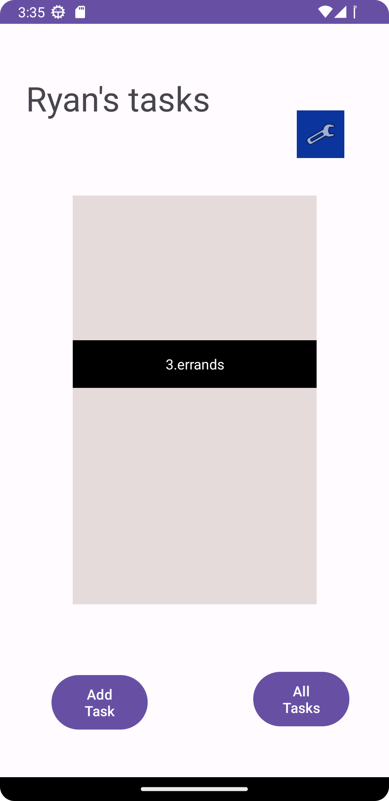

# Tasks Manager

This app will be utilized to set myself tasks.  I will be able to add, delete, 
and view all my tasks.

22 May
The functionality is currently simple.  The home page can send the user to the other pages,
and the addTasks activity page renders a submitted text box when clicked.  

23 May
We added the ability to persist data with shared preferences.  A user can now got to settings and 
change their user name.  We also now have a task description page which will soon be functional.

24 May

Today we added a working recycle view. It dynamically renders items like a conveyor belt.  You can also 
click on the items and get taken to the task details page.  

25 May 23

Today we connected Room db to our app.  Now the recycle view renders
information from the add task form.  You can also see the titke and body 
of the task on the task details page.

